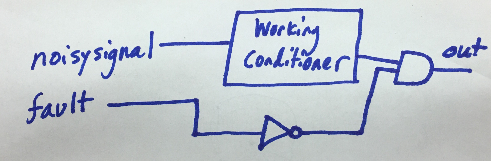

#Lab 2 Write-Up
####Nur Shlapobersky, David Abrahams, Kai Levy

## Run our test benches

To run our test benches, run the appropriate bash script in the `tests` directory from the top level project directory. For example:

```
$ ./build/shiftRegister
VCD info: dumpfile shftregister.vcd opened for output.
...
1            | 1                 | 00000000       | 11101010        | 11101010
```

##Input Conditioner

#####Circuit


#####Test Bench Output and Waveforms

```
pin conditioned rising falling | Expected
Testing input sync
1   1           1      0       | 1 1 1 0
Testing debouncing
0   1           0      0       | 0 1 0 0
Testing edge detection: falling
0   0           0      1       | 0 0 0 1
Testing edge detection: rising
1   1           1      0       | 1 1 1 0
```


We first check that input synchronization works by changing `noisysignal` at an offset from the clock, and then checking `conditioned` on clock edges. We check debouncing by flickering `noisysignal` on and off and ensuring `conditioned` remains constant. We check that `positiveedge` and `negativeedge` work by forcing `conditioned` to change, and then checking their outputs on the clock cycle where `conditioned` changed. They both go on for one clock cycle, then back off.

#####Question

Question: If the main system clock is running at 50MHz, what is the maximum length input glitch that will be suppressed by this design for a `waittime` of 10? Include the analysis in your report.

Each clock cycle takes 1/(50 * 10^6) seconds, so for `waittime=10`, the maximum length glitch that would be suppressed would be up to (but not including) 10 clock cycles long, so 200 nanoseconds. If the glitch is 200 nanoseconds seconds or longer, it will be seen on 10 clock cycles, and be picked up by our input conditioner.

##Shift Register

#####Test Strategy

Test bench:

```
Testing parallel in, serial out.
parallelLoad | parallelDataIn | serialDataOut | Expected Out
1            | 10111010       | 1             | 1
-----------------------------------------------
Testing serial in, parallel out.
peripheralClkEdge | serialDataIn | parallelDataOut | Expected Out
1                 | 1            | 01110101        | 01110101
-----------------------------------------------
Testing parallel load and peripheralClkEdge. peripheralClkEdge wins.
parallelLoad | peripheralClkEdge | parallelDataIn | parallelDataOut | Expected Out
1            | 1                 | 00000000       | 11101010        | 11101010
```

First, we test our parallel load, serial out behavior by loading an 8-bit number into the shift register and getting back the most significant bit.

Then, we test our shifting by enabling the peripheral clock edge and loading a bit into the serial data in. We get back parallel data out, which is just like the parallel data that we loaded in the previous test, but shifted over once and with our serial data bit on the end.

Finally, we make sure that we cannot both do parallel load and shift by enabling both. We find that the parallel data out is shifted again, rather than being overwritten by the parallel data in.

## Midpoint Checkin

Below is a link showing our shift register being tested.

tinyurl.com/midpointcheckin

## Fault Injection

Our injectable failure mode is that the input conditioner failes to actually "condition" the input, and rather passes its input signal straight through. This could be due to a manufacturing error which resulted in the input wire being shorted to the output. We simulate this by putting our entire input conditioner in an if-else block, where if `fault==0` we condition the input as normal, otherwise we assign output to input. A circuit representation of this fault is shown below.



We could test this by making `CS`'s conditioner faulty. Then, if `CS` ever flickers, the FSM would reset its state to `GET`.


## Test Strategy

For our test strategy, we tried consecutively writing then reading every single value possibility (0-127), to and from every single memory address (0-255). If the read output is the same as what we write, for every possibility, then our test passes.

```
int tests_passed = 1;
for(int addr = 0; addr < 128; addr = addr + 1 )
{
	for (int value = 0; value < 256; value = value + 1 )
	{
		spi_write(&SpiInstance, addr, value);
		u8 res = spi_read(&SpiInstance, addr);
		if (res != value)
		{
			xil_printf("Test failed!!! Wrote to %X. %X transmitted. %X readback.\n\r", addr, value, res);
			tests_passed = 0;
		} else
		{
			xil_printf("Test passed");
		}

	}
}
```

##Work Plan Reflection

